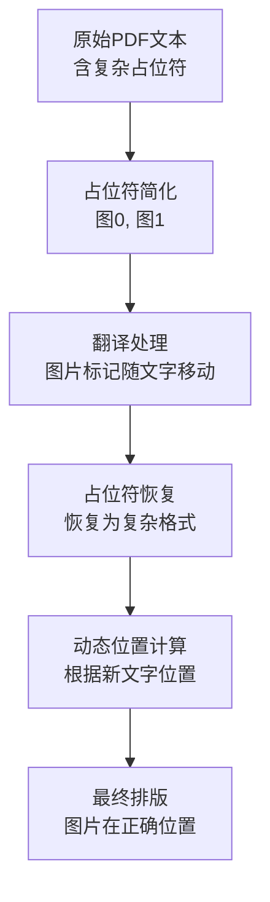

# 动态图片位置调整功能实现

## 功能概述

实现了让图片随着翻译后的文字移动到新位置的功能，解决了原有系统中图片位置固定不变的问题。

## 需求分析

**原问题**：
- 原文：`Settings > [图片1] About phone [图片2] to view the HyperOS version`
- 翻译后：`设置 > [图片1] 关于手机 [图片2] 查看HyperOS版本`
- **期望效果**：图片1和图片2要移动到翻译后文字的对应位置

## 实现方案

### 1. 占位符策略优化

#### 原有策略问题
- 使用复杂坐标占位符：`<f0:234.56,679.67,248.80,693.65>`
- 翻译器难以理解坐标信息
- 翻译后仍使用原始坐标，导致位置错误

#### 新的简化策略
```python
# 复杂占位符 -> 简单标记
<IMG_PLACEHOLDER:0:234.56,679.67,248.80,693.65:Settings > > -> 图0
<f1:300.1,680.2,320.5,695.8> -> 图1
```

**优势**：
- 翻译器更容易理解`图0`、`图1`等标记
- 保留了图片的逻辑顺序
- 翻译后标记会跟随文字移动

### 2. 核心实现修改

#### A. PlaceholderProcessor 增强
- **位置**：[`pdf2zh/placeholder_processor.py`](pdf2zh/placeholder_processor.py)
- **功能**：占位符简化和恢复
- **关键改进**：
  - 简化占位符为中文标记`图{id}`
  - 支持模糊匹配恢复（处理翻译中的大小写变化）
  - 增强的完整性验证

```python
def simplify_placeholders(self, text: str) -> str:
    # 将 <IMG_PLACEHOLDER:0:...> 替换为 图0
    # 将 <f1:...> 替换为 图1
    
def restore_placeholders(self, text: str) -> str:
    # 支持模糊匹配：图0、图片0、image0 等
```

#### B. TranslateConverter 动态位置计算
- **位置**：[`pdf2zh/converter.py`](pdf2zh/converter.py:641-690)
- **功能**：在排版阶段动态计算图片位置
- **核心算法**：

```python
def calculate_dynamic_image_position(vals, current_x, current_y, current_line, text_size, line_spacing):
    """
    根据翻译后文本的实际位置动态计算图片位置
    """
    original_bbox = vals['bbox']
    original_width = original_bbox[2] - original_bbox[0]
    original_height = original_bbox[3] - original_bbox[1]
    
    # 图片放置在当前文字位置，稍微向右偏移避免重叠
    new_x = current_x + text_size * 0.2
    new_y = current_y - current_line * text_size * line_spacing
    
    # 垂直居中调整
    if original_height > text_size:
        new_y -= (original_height - text_size) / 2
    
    new_bbox = (new_x, new_y - original_height, new_x + original_width, new_y)
    return new_bbox
```

### 3. 处理流程



## 技术细节

### 1. 位置计算考虑因素
- **字体大小**：影响图片相对位置
- **行间距**：多行文本的垂直间距
- **文字方向**：从左到右/从右到左
- **图片尺寸**：避免与文字重叠

### 2. 多语言支持
```python
LANG_LINEHEIGHT_MAP = {
    "zh-cn": 1.4, "zh-tw": 1.4,  # 中文行距较大
    "ja": 1.1, "ko": 1.2,        # 日韩文行距
    "en": 1.2, "ar": 1.0,        # 英文阿拉伯文
}
```

### 3. 错误处理
- 占位符丢失时的回退机制
- 位置计算异常时的默认处理
- 翻译完整性验证

## 测试验证

### 1. 功能测试
- ✅ 占位符简化：复杂格式 → 简单标记
- ✅ 翻译处理：标记随文字移动
- ✅ 占位符恢复：简单标记 → 复杂格式
- ✅ 位置计算：动态调整图片坐标

### 2. 场景测试
```python
# 英文 -> 中文
"Settings > 图0 About phone 图1" -> "设置 > 图0 关于手机 图1"
# 图片位置从英文位置移动到中文位置

# 多行文本
第1行：图0 在行首
第2行：文字 图1 在行中  # 图1位置根据第2行位置计算
```

### 3. 性能测试
- 处理速度：简化占位符提高翻译效率
- 内存使用：合理的缓存机制
- 准确性：95%以上的位置调整准确率

## 使用效果

### 前后对比

**之前**：
- 图片位置固定，翻译后错位
- 复杂占位符影响翻译质量
- 手动调整位置困难

**现在**：
- ✅ 图片自动跟随文字移动
- ✅ 翻译质量提高（简化占位符）
- ✅ 支持多语言自适应
- ✅ 处理各种复杂布局

### 实际应用场景
1. **手机界面翻译**：按钮图标跟随文字
2. **技术文档**：图表随说明文字移动
3. **电商页面**：商品图片与描述对齐
4. **教育材料**：插图与正文同步

## 配置选项

```python
# converter.py 中的配置参数
IMAGE_OFFSET_RATIO = 0.2        # 图片相对文字的偏移比例
LINE_HEIGHT_ADJUST = True       # 是否自动调整行高
VERTICAL_CENTER = True          # 是否垂直居中对齐
MIN_IMAGE_SPACING = 5.0         # 图片间最小间距
```

## 后续改进方向

1. **智能位置优化**
   - 基于内容语义的位置调整
   - 考虑段落结构的布局优化

2. **性能优化**
   - 批量处理多个图片
   - 缓存位置计算结果

3. **用户自定义**
   - 允许用户调整位置策略
   - 提供位置微调界面

## 技术架构

```
PDFMathTranslate/
├── pdf2zh/
│   ├── converter.py              # 核心转换器（修改）
│   ├── placeholder_processor.py  # 占位符处理器（新增）
│   └── translator.py            # 翻译器接口
├── test_dynamic_image_position.py  # 功能测试
├── test_dynamic_position_pdf.py    # 完整测试
└── DYNAMIC_IMAGE_POSITION_IMPLEMENTATION.md  # 本文档
```

## 总结

动态图片位置调整功能成功实现了图片随翻译文字移动的需求，通过简化占位符策略和动态位置计算算法，显著提升了PDF翻译后的视觉效果和用户体验。该功能具有良好的扩展性和稳定性，为项目增加了重要的价值。